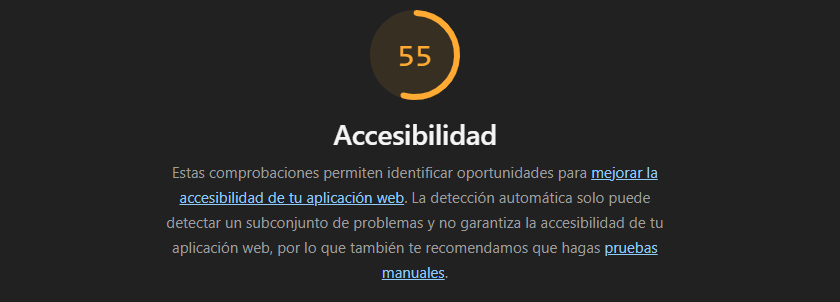
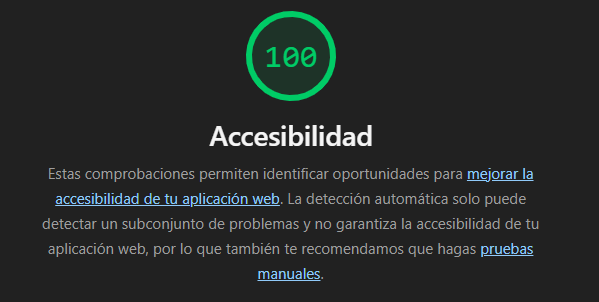
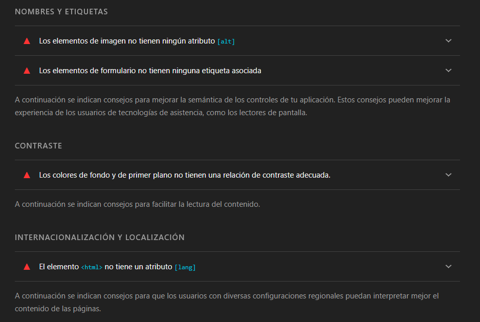
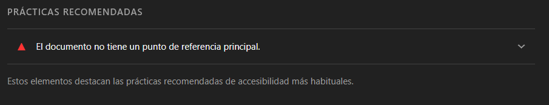
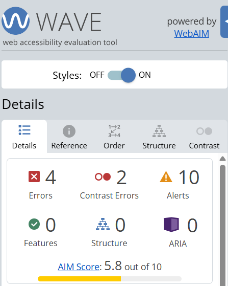
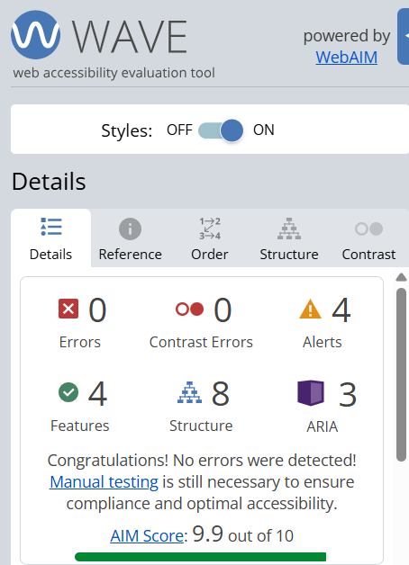
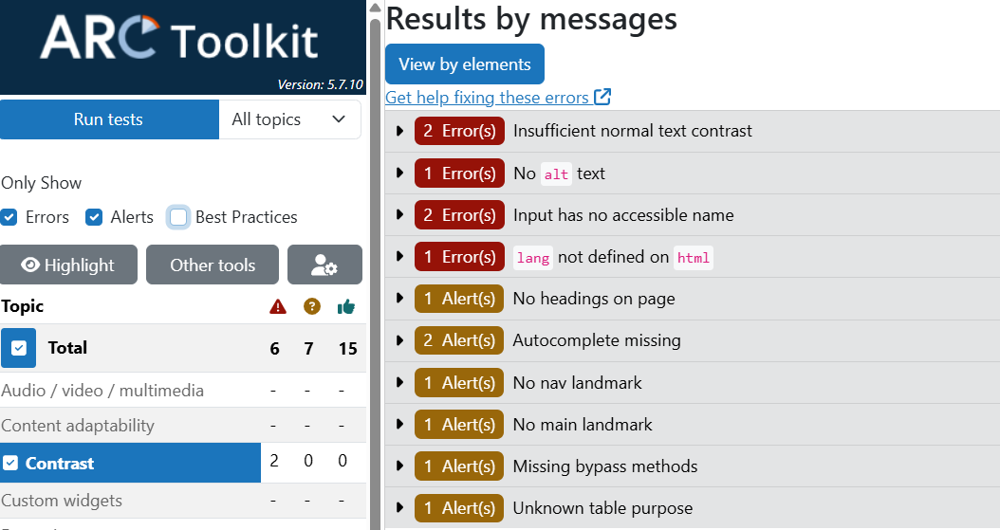
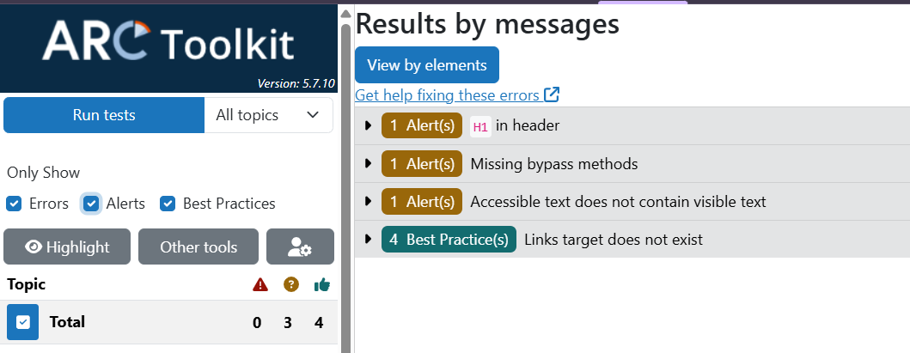
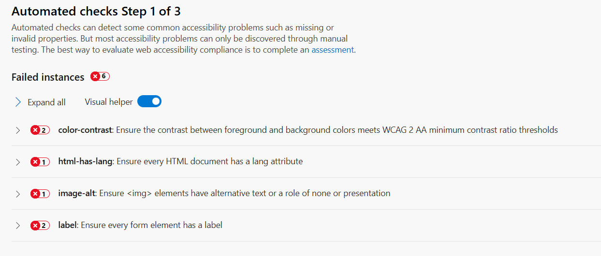
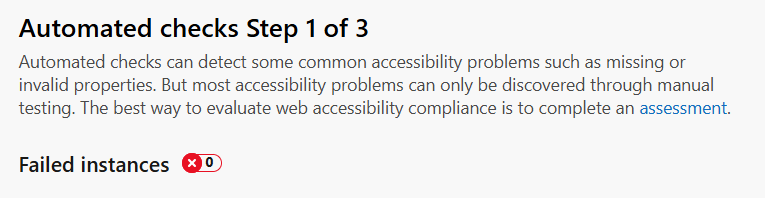

# ♿ Accesibilidad Web - Refactoring WCAG 2.2 (A, AA, AAA) + AI

<p align="center">
  <a href="https://vicenttto.github.io/proyectos/accesibilidad-wcag/index.html">
    
  </a>
  <a href="https://vicenttto.github.io/proyectos/accesibilidad-wcag/index-old.html">
    
  </a>
</p>

<p align="center">
  
  
  
</p>

<p align="center">
  
  
  
  
</p>

Este proyecto documenta un proceso de refactorización riguroso para elevar un sitio web heredado ("legacy") a los estándares de accesibilidad **WCAG 2.2 (Niveles A, AA y AAA)**. Se ha utilizado **Ingeniería de Prompts** aplicada a asistentes de IA para transformar un código con fallos críticos en una interfaz inclusiva, siguiendo las directrices de **Olga Carreras**.

_This project documents a rigorous refactoring process to upgrade a legacy website to **WCAG 2.2 (Levels A, AA, and AAA)** standards. Using **Prompt Engineering** applied to AI assistants, critical code failures have been transformed into an inclusive interface, following **Olga Carreras'** guidelines._

---

## 🛠️ Proceso de Trabajo / Work Process

### 🇪🇸 Español

El desarrollo se basó en una metodología iterativa. Primero, se realizó un diagnóstico de barreras de acceso. Segundo, se redactó un prompt de alta precisión para guiar a la IA en la corrección semántica y técnica. Finalmente, se ejecutó una **validación cruzada con cuatro herramientas** para garantizar que ningún error persistiera, logrando el cumplimiento total de los niveles AA y AAA.

### 🇺🇸 English

The development was based on an iterative methodology. First, a diagnosis of access barriers was performed. Second, a high-precision prompt was drafted to guide the AI in semantic and technical correction. Finally, a **cross-validation with four tools** was executed to ensure no errors persisted, achieving full compliance with AA and AAA levels.

---

## 🎯 Ingeniería del Prompt / Prompt Engineering

Se diseñó un prompt basado en el framework **Rol-Tarea-Restricción** para asegurar una respuesta técnica precisa en el primer intento.

> **Prompt:** _"Actúa como un Experto Senior en Accesibilidad Web. Refactoriza el código HTML proporcionado para cumplir estrictamente con WCAG 2.2 (Nivel AA/AAA). Requisitos: 1. Semántica HTML5 completa (<header>, <nav>, <main>, <section>). 2. Contraste AAA (>7:1). 3. Etiquetas <label> vinculadas por ID. 4. Navegación por teclado con foco visible. 5. Atributos ARIA y jerarquía de encabezados según Olga Carreras. Entrega solo el código."_

---

## 🔍 Validación por Herramientas / Tool Validation

### 1. Google Lighthouse

- **🇪🇸 Explicación:** Auditoría automatizada para medir la calidad técnica y accesibilidad global.
- **🇺🇸 Explanation:** Automated audit to measure technical quality and global accessibility.

<p align="center">
  
  
</p>
<p align="center">
  
  
</p>

---

### 2. WAVE (Web Accessibility Evaluation Tool)

- **🇪🇸 Explicación:** Evaluación visual de la estructura semántica y contraste.
- **🇺🇸 Explanation:** Visual evaluation of semantic structure and contrast.

<p align="center">
  
  
</p>

---

### 3. ARC Toolkit (TPGi)

- **🇪🇸 Explicación:** Análisis técnico de nodos, nombres accesibles y roles ARIA.
- **🇺🇸 Explanation:** Technical analysis of nodes, accessible names, and ARIA roles.

<p align="center">
  
  
</p>

---

### 4. Accessibility Insights (Microsoft)

- **🇪🇸 Explicación:** Comprobaciones automáticas de internacionalización y formularios.
- **🇺🇸 Explanation:** Automated checks for internationalization and forms.

<p align="center">
  
  
</p>

---

## 📂 Estructura de Archivos / File Structure

```text
/accesibilidad-wcag
├── images/                           # Capturas de evidencias (Antes/Después)
├── index-old.html                    # ❌ Código original inaccesible
├── index.html                        # ✅ Código final accesible 100%
└── README.md                         # Documentación técnica bilingüe
```
